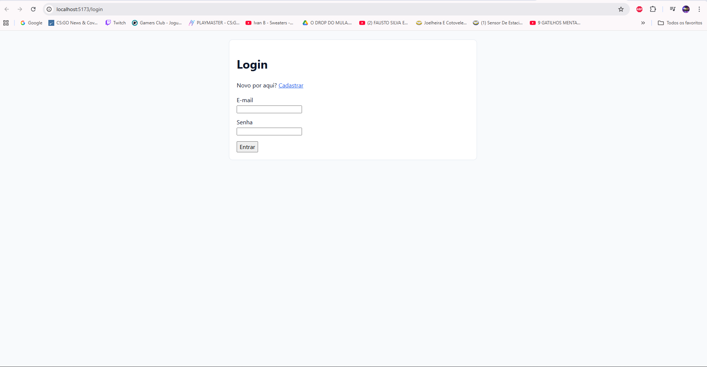
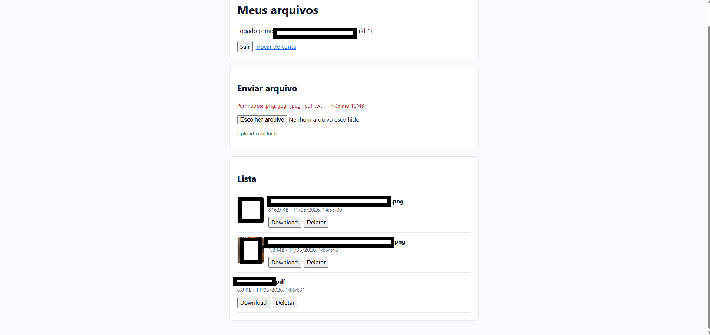
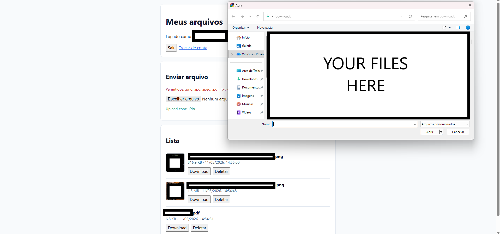
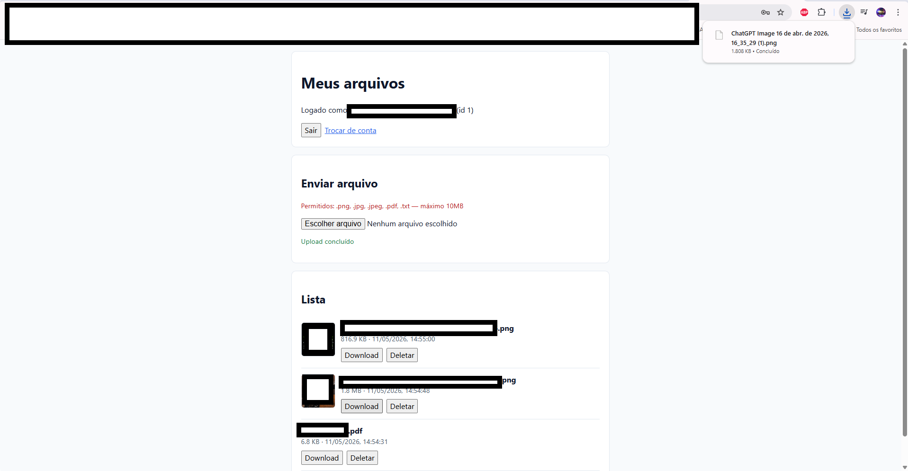

# File Manager App

[🇺🇸 English](README.md) | 🇧🇷 Português


## Descrição

Aplicação fullstack de gerenciamento de arquivos com React, TypeScript, Django REST Framework e PostgreSQL.

---

## Funcionalidades

- Cadastro e login (sessão)
- Upload com validação de extensão e tamanho (`.png`, `.jpg`, `.jpeg`, `.pdf`, `.txt`, máx. 10MB)
- Listagem de arquivos apenas do usuário autenticado
- Download com **streaming no servidor** (`FileResponse` do Django)
- Pré-visualização de imagens (miniaturas)
- Exclusão de arquivos
- Proteção CSRF nas operações que alteram estado
- Ambiente dockerizado (PostgreSQL, API, frontend)
- Testes automatizados: `pytest` (API) e Playwright (fluxo E2E)

---

## Capturas de tela









---

## Arquitetura

```
React SPA
    ↓  HTTP (JSON, multipart, cookies)
Django REST API
    ↓  ORM
PostgreSQL
```

O **frontend** (SPA React) consome apenas HTTP: cookies de sessão, JSON para autenticação e `multipart/form-data` para upload. O **backend** persiste usuários e metadados no **PostgreSQL** e grava os binários em disco (media do Django).

**Motivo da separação SPA/API:** evolução independente da interface e da API; regras de autorização e validação ficam centralizadas no servidor. **Benefício:** testes de API isolados e possibilidade de outros clientes sem duplicar lógica de armazenamento.

---

## Stack tecnológica

**Frontend:** React, TypeScript, Vite, Fetch API (e `XMLHttpRequest` para progresso de upload).

**Backend:** Django, Django REST Framework.

**Banco:** PostgreSQL (SQLite opcional com `USE_SQLITE=1` para testes/ferramentas locais).

**Infraestrutura:** Docker, Docker Compose.

**Testes:** pytest, pytest-django, Playwright.

---

## Decisões técnicas

- **PostgreSQL:** metadados relacionais e concorrência alinhados ao ORM do Django.
- **DRF:** serializers, permissões e autenticação padronizadas em cima do Django.
- **React + TypeScript:** UI modular com tipagem para reduzir erros.
- **Docker Compose:** ambiente reproduzível; no Compose, o Vite do frontend faz proxy de `/api` para o serviço `backend`.
- **Download em stream:** `FileResponse` lê o arquivo em modo binário e envia em streaming, sem carregar o arquivo inteiro na memória do processo.
- **SPA + API:** servidor focado em regras de dados e I/O; navegador hospeda a interface.

---

## Estrutura do projeto

```
project/
├── backend/
├── frontend/
├── docker-compose.yml
├── README.md
├── README_PTBR.md
└── LICENSE
```

---

## Como rodar

### 1. Clonar

```bash
git clone <url-do-repositório>
cd simple_CRUD
```

### 2. Variáveis do backend

Crie `backend/.env` (veja seção abaixo). Com Docker Compose, use `POSTGRES_HOST=db`.

### 3. Docker Compose

Na raiz do projeto (onde está `docker-compose.yml`):

```bash
docker compose up --build
```

O container do backend já executa `migrate` antes do `runserver`.

### 4. Acessos

| Serviço   | URL                          |
|-----------|------------------------------|
| Frontend  | http://localhost:5173        |
| Backend   | http://localhost:8000        |
| Admin     | http://localhost:8000/admin/ |

Saúde da API: `GET http://localhost:8000/api/health/`

### Desenvolvimento local sem Docker (opcional)

Suba o Django em `backend/` (ex.: `USE_SQLITE=1` ou Postgres local). Em `frontend/`, `npm run dev`. O proxy padrão do Vite aponta para `http://backend:8000` (nome do serviço no Compose); na máquina host, altere `server.proxy` em `frontend/vite.config.ts` para `http://127.0.0.1:8000` se o Django estiver em localhost.

---

## Variáveis de ambiente

### Backend (`backend/.env`)

Exemplo:

```env
DJANGO_SECRET_KEY=troque-em-producao
DJANGO_DEBUG=1
DJANGO_ALLOWED_HOSTS=backend,localhost,127.0.0.1

POSTGRES_DB=fileapp
POSTGRES_USER=app
POSTGRES_PASSWORD=app
POSTGRES_HOST=db
POSTGRES_PORT=5432

USE_SQLITE=0

CORS_ALLOWED_ORIGINS=http://localhost:5173,http://127.0.0.1:5173
CSRF_TRUSTED_ORIGINS=http://localhost:5173,http://127.0.0.1:5173,http://localhost:8000,http://127.0.0.1:8000
```

### Frontend

O código usa URLs relativas (`/api/...`). Não há `.env` obrigatório no setup atual com Vite + proxy.

---

## Endpoints da API

| Método | Caminho | Descrição |
|--------|---------|-----------|
| GET | `/api/health/` | Status |
| GET | `/api/csrf/` | Token CSRF |
| POST | `/api/auth/register/` | Cadastro |
| POST | `/api/auth/login/` | Login (cookie de sessão) |
| POST | `/api/auth/logout/` | Logout |
| GET | `/api/auth/me/` | Usuário atual |
| GET | `/api/files/` | Lista arquivos |
| POST | `/api/files/` | Upload (`file`) |
| GET | `/api/files/<id>/download/` | Download |
| GET | `/api/files/<id>/preview/` | Preview (só imagens) |
| DELETE | `/api/files/<id>/` | Remove arquivo |

---

## Segurança

- Sessão Django + DRF autenticado nas rotas de arquivos.
- Arquivos filtrados por `user=request.user`.
- Validação de extensão e tamanho no upload; limites também em `settings.py`.
- Senhas com hash do Django (`create_user`).
- CSRF nas mutações disparadas pelo SPA.

---

## Testes automatizados

**Backend** (`backend/`):

```bash
USE_SQLITE=1 python -m pytest
```

**Playwright** (`frontend/`):

```bash
npx playwright install chromium
npm run test:e2e
```

---

## Melhorias futuras

- Armazenamento em cloud
- Processamento assíncrono (fila)
- Cache/CDN

---

## Licença

MIT — veja [LICENSE](LICENSE).
